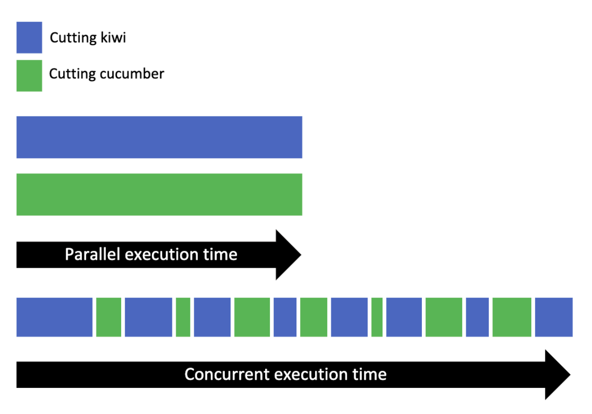

# How to use asyncio, threading and multiprocessing

Note: asynchronous and sychronous refer to the conceptual programming model, whereas concurrency and parallelism describe how the actual processes/threads are executed.

## Async vs Sync
- Synchronous: A task must wait for the previous task to finish executing (blocking operations)
- Asynchormous: A task do not need to wait for others, can execute independently (non-blocking operations)

## IO task and CPU task
- IO task: input, output, read/write file, networking, RAM. CPU is idle when IO task is executing. The time is mainly due to CPU has to **wait** for something
- CPU task: computation e.g matrix multiplication

## Concurrency vs Parallelism
- Parallelism : Tasks are executed **simultaneously** (<code>multiprocessing</code> library in python)
- Concurrency: Tasks does not depend on each other and can be executed in any order. While 1 task is waiting (in computer, usually IO task), other task can be executed. (<code>threading</code>, <code>asyncio</code> in python)


### Why concurrency is useful/faster than just execute task sequentially/synchronously?
Running a program concurrently does not guarantee it to run faster. Concurrency only make the program faster when the program IO bound, i.e IO operations take a long time to complete.

Let looks at examples in file <code>demo/demo_sequential.py</code> and <code>demo/demo_concurrent_thread_old.py</code>
In the <code>demo/demo_sequential.py</code> file the program is executed like the below figure.

The program <code>demo/demo_concurrent_thread_old.py</code> is executed concurrently as follow:

This is because when <code>time.sleep(1)</code> is called, the CPU idles (IO task), thus allow the it to execute next function immediately (concurrently). If the CPU is not idle, running the program concurrently can make it slower due to time taken to create and destroy threads. Thus, concurrency can help IO bound program run faster.

In conclusion, if a program is IO bound, use concurrency with <code>asyncio</code> or <code>threading</code>. Else if the program is CPU intensive, use <code>multiprocessing</code>.

However there is still 1 question: When to use <code>threading</code> vs <code>asyncio</code>?

## Process vs Thread vs Coroutine
Coroutine lives in thread, thread lives in process, process lives in core, core lives in cpu
&rarr; Threads cannot be executed in parallel in a single core.

### Difference between Threads (threading) and Coroutines (asyncio)
Threads and Coroutine differ in how each task take turns to execute
- Thread: Controlled by the OS, OS handle the interruption and execution of each thread, OS can interrupt threads **at any time** (preemptive multitasking).
- Coroutine: Developers/Programming languages determine when to switch coroutine, each coroutine announce when it will be swapped out (cooperative multitaksing). Coroutine is cheaper to do context switch

<code>asyncio</code> vs <code>threading</code>
In addition to the difference between couroutine and thread, <code>asyncio</code> also has an event loop which tracks different I/O events and switches to tasks which are ready and pauses the ones which are waiting on I/O.
asyncio scales better than threading. Each task takes far fewer resources and less time to create than a thread, so creating and running more of them works well.

In <code>threading</code>, OS will **automatically** execute a different thread if the processor is idle (e.g. ```time.sleep()```).
In <code>asyncio</code>, Python will not pause and allow something else to execute just because it is sleeping. The only time a coroutine might pause and let something else run is when it was awaited (```await```) (cooperative multitask), so ```time.sleep``` has to be replaced by ```await asyncio.sleep()```.

Issues with asyncio:
- Requires an async version of libraries, e.g: <code>aiohttp</code> instead of <code>requests</code>
- If one task doesn't cooperate (due to programmer's mistake), program doesn't work

## Conclusion
```
if io_bound:
    if io_very_slow:
        print("Use Asyncio")
    else:
       print("Use Threads")
else:
    print("Multi Processing")
```
- CPU Bound => Multi Processing
- I/O Bound, Fast I/O, Limited Number of Connections => Multi Threading
- I/O Bound, Slow I/O, Many connections => Asyncio


## References
https://realpython.com/python-concurrency/
http://masnun.rocks/2016/10/06/async-python-the-different-forms-of-concurrency/
https://stackoverflow.com/questions/27435284/multiprocessing-vs-multithreading-vs-asyncio
https://stackoverflow.com/questions/1934715/difference-between-a-coroutine-and-a-thread
https://sekiro-j.github.io/post/tcp/
https://www.youtube.com/watch?v=IEEhzQoKtQU
https://www.youtube.com/watch?v=fKl2JW_qrso
https://www.youtube.com/watch?v=t5Bo1Je9EmE