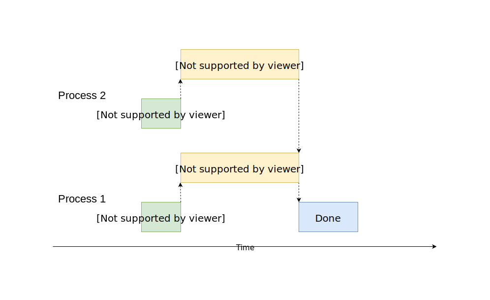

# Multiprocessing 

Multiprocessing can be used for IO task and CPU task, usually for CPU task. Unlike concurrency, `multiprocessing` run multiple functions on different process **at the same time**. Concurrency is preferred for IO task since it takes longer to create process than create threads.

